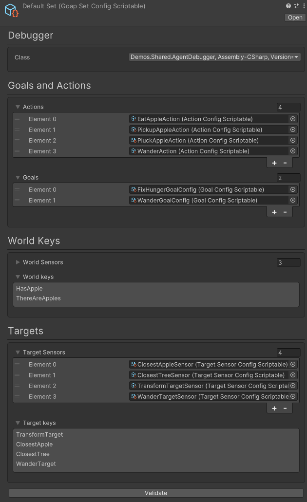

# GoapSet

A `GoapSet` is a collection of all possible `Goals` and `Actions` that an agent can utilize. By using different `GoapSets`, you can customize the behavior of various agents, allowing each to have its unique set of `Goals` and `Actions`.



## GoapSet Config

The `GoapSetConfig` is the tool used to define and organize a `GoapSet`. It comprises several properties that detail the available configurations for an agent:

### 1. Goals

**Description**: Goals represent the objectives or desires of an agent. They define what the agent wants to achieve.

This property holds a list of `GoalConfigs`, detailing the various objectives an agent can pursue.

### 2. Actions

**Description**: Actions are the tasks or behaviors an agent can perform. They are the means by which an agent tries to achieve its goals.

This property contains a list of `ActionConfigs`, outlining the set of actions available for the agent to execute.

### 3. Target Sensors

**Description**: Target Sensors help the agent identify and locate important positions or objects in the game world. They can point to static locations or dynamic entities that might move.

This is a list of `TargetSensorConfigs`, assisting the agent in determining key positions or targets it should be aware of.

### 4. World Sensors

**Description**: World Sensors allow the agent to perceive and understand various states or situations in the game. They provide the agent with information about the environment, helping it make informed decisions.

This property holds a list of `WorldSensorConfigs`, enabling the agent to gather data about the game's current state.

By configuring the `GoapSetConfig` appropriately, you can tailor the behavior and capabilities of agents, ensuring they act and react in ways that suit the game's requirements.

---

## Agent Debugger Class
By defining an agent debugger class you can customize the data show in the node viewer in the `Agent data` box. The agent debugger class must inherit from `IAgentDebugger` and be assigned to the property.


```csharp
using CrashKonijn.Goap.Interfaces;
using Demos.Shared.Behaviours;

public class AgentDebugger : IAgentDebugger
{
    public string GetInfo(IMonoAgent agent, IComponentReference references)
    {
        var hunger = references.GetCachedComponent<HungerBehaviour>();
        
        return $"Hunger: {hunger.hunger}";
    }
}
```

